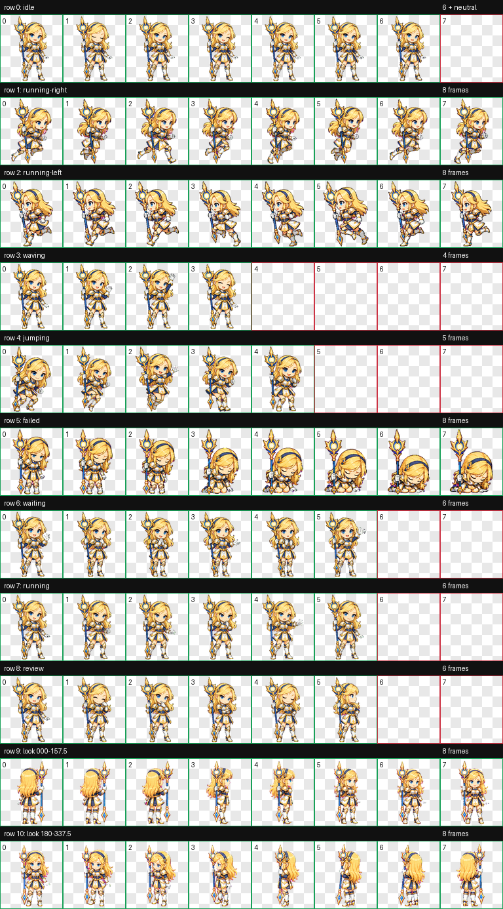

# Luxbyte — Codex Pet

Luxbyte is a fan-made animated Codex pet inspired by the classic/default look of Lux from *League of Legends*.

The package uses the Codex pet v2 format:

- 9 standard animation rows
- 16 clockwise look directions
- 1536 × 2288 WebP spritesheet
- transparent background



## Install on Windows

1. Create this folder if it does not exist:

   ```text
   %USERPROFILE%\.codex\pets\luxbyte
   ```

2. Copy `pet.json` and `spritesheet.webp` into that folder.
3. In Codex, open **Settings → Personalization → Pets**.
4. Under **Custom pets**, click **Refresh**.
5. Under **Pick a pet**, select **Luxbyte**, then click **Wake Pet** if pets are hidden.

## Files

- `pet.json` — Codex pet manifest
- `spritesheet.webp` — validated v2 animation atlas
- `preview.png` — labeled contact sheet

## Notice

Luxbyte was created under Riot Games' "Legal Jibber Jabber" policy using assets owned by Riot Games. Riot Games does not endorse or sponsor this project.

This is a free, noncommercial fan project. Lux and League of Legends are trademarks and intellectual property of Riot Games.
